# gh-wallpaper

Your GitHub contribution heatmap as your desktop wallpaper. Built for macOS; Linux beta available — same renderer, same headline. Refreshes itself in the background so your desktop always reflects what you've shipped this year.

[](https://github.com/Numbatt/github-heatmap-wallpaper/releases)
[](https://github.com/Numbatt/github-heatmap-wallpaper/actions/workflows/ci.yml)


[](LICENSE)
[](https://github.com/Numbatt/github-heatmap-wallpaper/stargazers)


If you find this useful, please [leave a star](https://github.com/Numbatt/github-heatmap-wallpaper)! It's the only way I know people are getting value from it.

<!-- install-stats:start -->
**Installs of latest release (v0.2.6):** 4 · [full stats & methodology](docs/INSTALL_STATS.md)
<!-- install-stats:end -->

---

## Features

- 🎨 **12 built-in themes** plus an `auto` mode that follows macOS Light/Dark — or design your own in a **native visual editor** (`gh-wallpaper my-theme`).
- 🖼️ **Custom JSON themes & image backgrounds** — drop any photo behind your heatmap with a tunable dim overlay.
- 🔄 **Self-updating** — a background daemon re-renders on wake, network-up, display change, and login, with adaptive polling. It only redraws when your contribution data actually changed.
- 🖥️ **Multi-display & HiDPI aware** on macOS.
- ✍️ **Custom headline text** and optional **daily theme / headline rotation**.
- 🔒 **Private by design** — reads only your *public* contribution graph. No PAT, no OAuth, no telemetry.
- 🍺 **One-line install** via Homebrew (macOS); **Linux beta** via `systemd`.

## Table of Contents

- [Features](#features)
- [Install](#install)
- [Themes](#themes) · [Custom themes](#custom-themes) · [Image backgrounds](#image-backgrounds)
- [How the background daemon works](#how-the-background-daemon-works)
- [How it gets your contribution data](#how-it-gets-your-contribution-data)
- [Linux (beta)](#linux-beta)
- [Requirements](#requirements)
- [Design notes](#design-notes)

---

## Install

```sh
brew install Numbatt/tap/gh-wallpaper
```

That's it. Or, equivalently:

```sh
brew tap Numbatt/tap
brew install gh-wallpaper
```

### From source (macOS)

If you'd rather build locally (e.g. you don't use Homebrew):

```sh
git clone https://github.com/Numbatt/github-heatmap-wallpaper
cd github-heatmap-wallpaper
./install.sh
```

`install.sh` checks for the Swift toolchain and `resvg`, builds the release binary, and copies it into your Homebrew prefix (or `/usr/local/bin`).

Then run the wizard:

```sh
gh-wallpaper
```

It'll ask for your GitHub username, theme, and which displays to use; preview the result; set the wallpaper; and register a background daemon. From that point on, your wallpaper updates itself.

### On Linux

```sh
git clone https://github.com/Numbatt/github-heatmap-wallpaper
cd github-heatmap-wallpaper
./contrib/linux/install.sh
gh-wallpaper init       # interactive: username, theme, canvas, wallpaper-setter
```

`init` writes the systemd drop-in for you, enables the hourly timer, and renders once. Re-run it any time to reconfigure. See the [Linux (beta) section](#linux-beta) below for what's supported and the manual setup path if you'd rather drive systemd directly.

---

## Themes

Twelve themes ship plus an `auto` mode that follows your macOS appearance setting:

<table>
  <tr>
    <td align="center"><b>github-dark</b><br>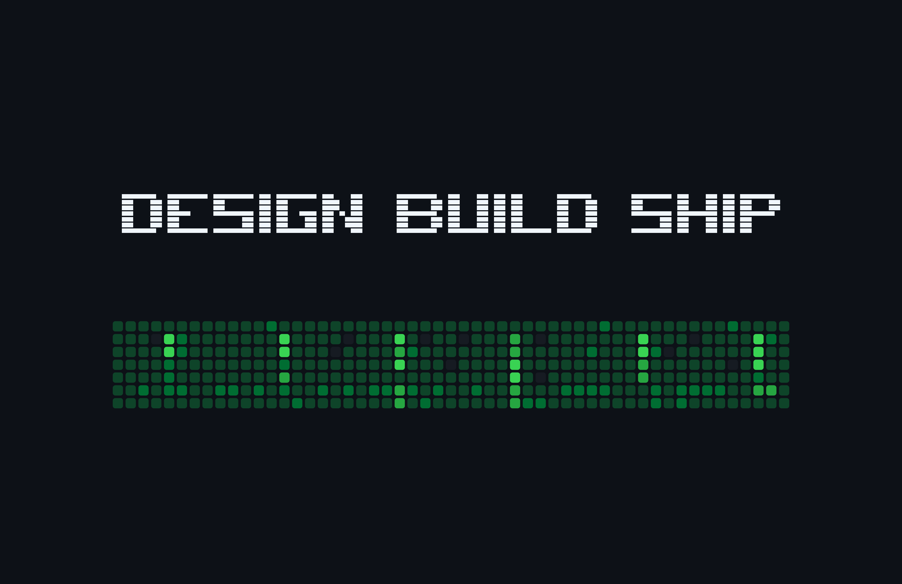</td>
    <td align="center"><b>github-light</b><br>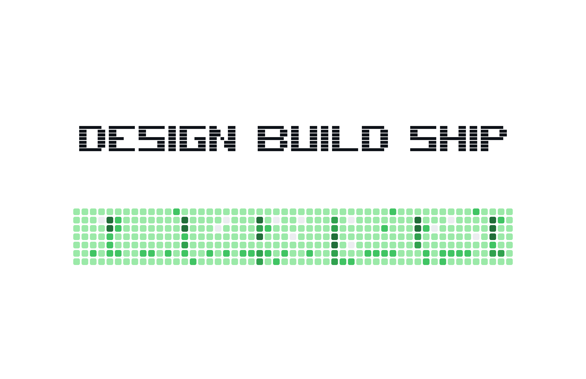</td>
  </tr>
  <tr>
    <td align="center"><b>tokyo-night</b><br>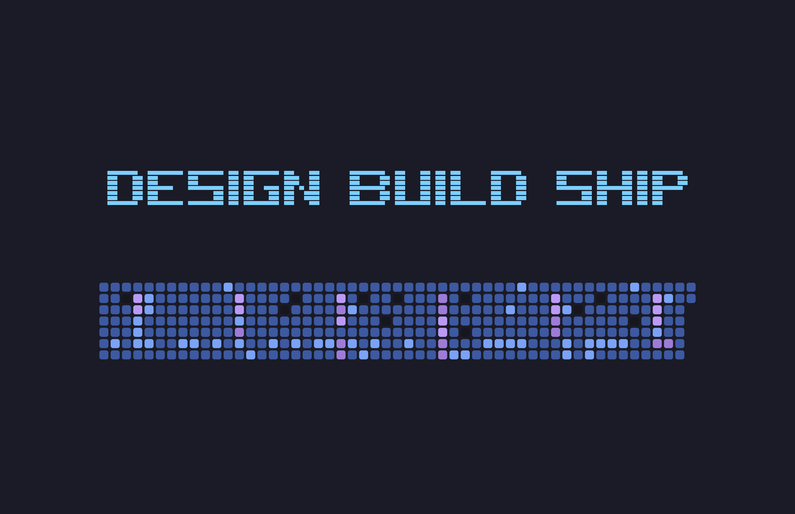</td>
    <td align="center"><b>dracula</b><br>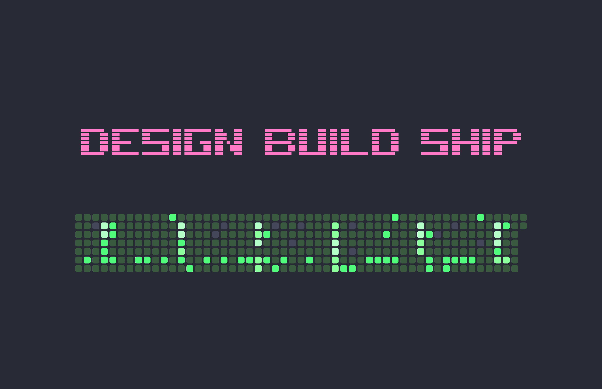</td>
  </tr>
  <tr>
    <td align="center"><b>nord</b><br>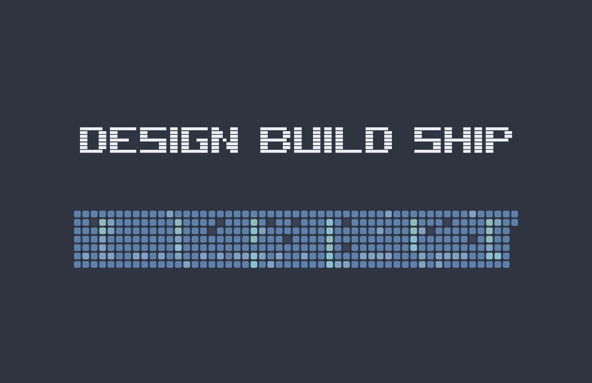</td>
    <td align="center"><b>gruvbox-dark</b><br>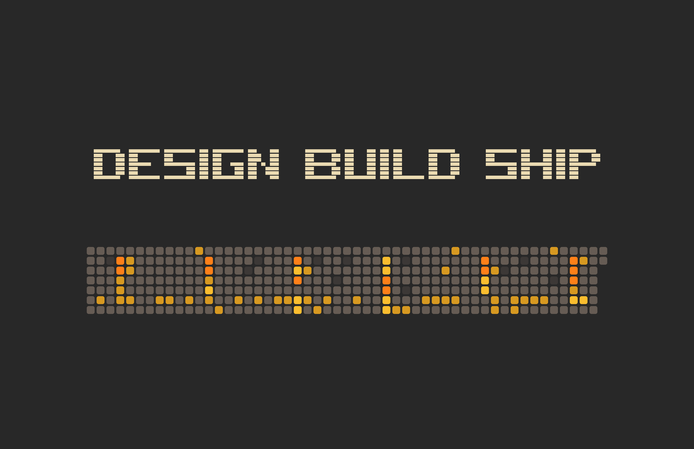</td>
  </tr>
  <tr>
    <td align="center"><b>catppuccin-frappe</b><br>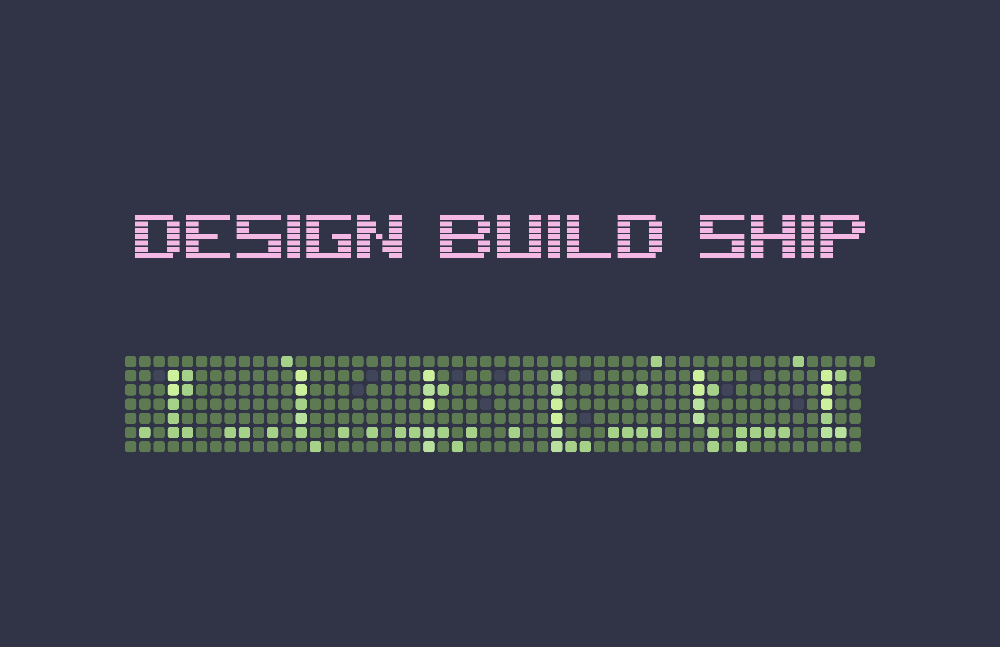</td>
    <td align="center"><b>catppuccin-mocha</b><br>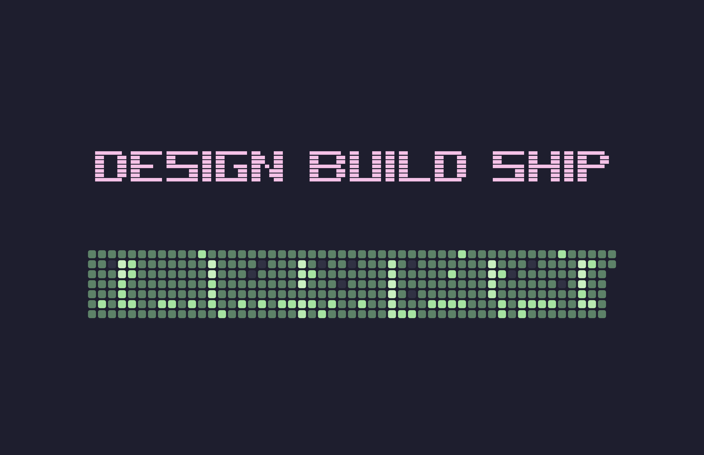</td>
  </tr>
  <tr>
    <td align="center"><b>midnight</b><br>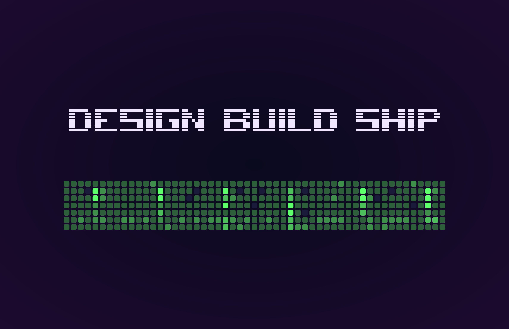</td>
    <td align="center"><b>paper</b><br>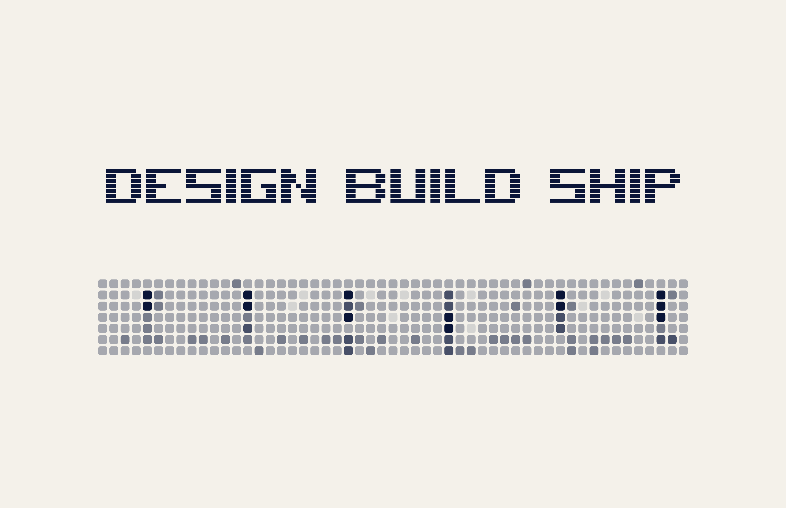</td>
  </tr>
  <tr>
    <td align="center"><b>blossom</b><br>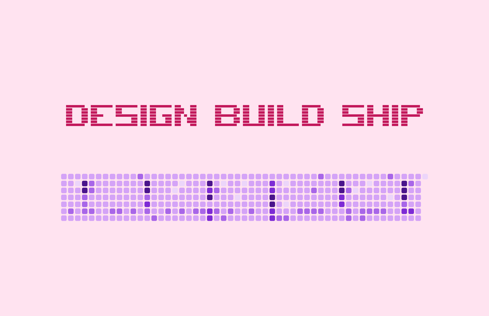</td>
    <td align="center"><b>ocean</b><br>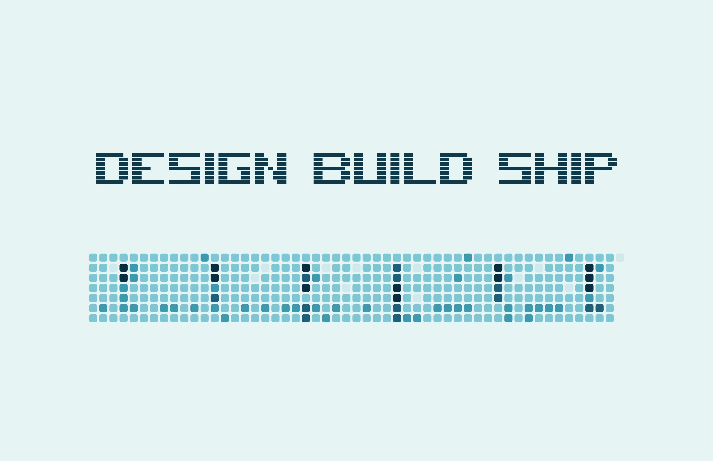</td>
  </tr>
</table>

- `auto` — sync with system appearance (default; switches between `github-light` and `github-dark` based on macOS Light/Dark Mode).
- `github-dark` / `github-light` — the canonical GitHub palettes.
- `tokyo-night` — deep midnight-blue with a blue→magenta ramp and a cyan headline.
- `dracula` — neon-green ramp anchored on `#50fa7b`, hot-pink headline.
- `nord` — cool polar-night base with a frost-blue ramp and a snow headline.
- `gruvbox-dark` — warm retro palette: yellow→orange ramp on a soft brown base, cream headline.
- `catppuccin-frappe` / `catppuccin-mocha` — Catppuccin palette with a pink headline and green ramp on each flavor's base.
- `midnight` — deep blue-purple gradient with a custom green ramp.
- `paper` — single-ink deep navy on textured off-white.
- `blossom` — purple ramp on pastel pink, rich rose headline.
- `ocean` — teal→navy ramp on pale aqua, slate headline.

Switch any time:

```sh
gh-wallpaper tokyo-night         # shorthand — works for any built-in or custom theme name
gh-wallpaper theme tokyo-night   # explicit form, same result
gh-wallpaper theme               # show current theme + list all available
gh-wallpaper edit                # open the visual editor for your current theme
```

The wallpaper re-renders immediately and the new theme persists.

### Custom themes

The fastest way to make or tweak a theme is the visual editor:

```sh
gh-wallpaper my-theme                      # unknown name → offers to create it
gh-wallpaper my-theme --from dracula       # ...seeded from an existing theme
gh-wallpaper edit                          # edit your current theme
gh-wallpaper theme dracula --edit          # fork a built-in (must rename on save)
gh-wallpaper theme my-theme --edit         # tweak a custom theme you already saved
```

Typing a name that isn't a known theme — e.g. `gh-wallpaper my-theme` — asks `Create a custom theme called 'my-theme'?` and opens the editor on yes. A native macOS window opens with system color pickers, an image-background picker, a dim slider, and a live preview. Inside the editor, the **"Apply defaults from…"** menu pastes any existing theme's palette onto your draft, or seed it up front with `--from <base>`. Click **Save & apply '<name>'** to commit and set it as your wallpaper immediately. Forking a built-in (`theme dracula --edit`) requires picking a new name on save — built-ins are immutable.

Other commands:

```sh
gh-wallpaper themes                  # list built-in + custom
gh-wallpaper themes delete my-theme  # remove a custom theme
gh-wallpaper themes export dracula > my-dracula.json   # share a theme as JSON
gh-wallpaper themes import < my-theme.json             # ingest from stdin
```

Power users can also drop a JSON file into `~/Library/Application Support/gh-wallpaper/themes/` directly:

```json
{
  "id": "aurora",
  "background": "#0b0f1a",
  "cellRamp": ["#1a2333", "#2e7d6b", "#56c596", "#8af3c5", "#c9ffe5"],
  "headlineColor": "#a78bfa"
}
```

- `cellRamp` must have exactly 5 colors (level 0 → level 4, low → high contributions).
- Colors are CSS hex (`#RGB`, `#RGBA`, `#RRGGBB`, or `#RRGGBBAA` — the alpha forms render translucent on top of the background).
- `backgroundIsGradient: true` lets you pass a `url(#id)` reference in `background` and an `<linearGradient>`/`<radialGradient>` block in `gradientSVG`. See the built-in `midnight` for an example.
- Files that fail validation are logged once and skipped; they don't break the daemon.

`gh-wallpaper themes` will list any custom themes alongside the built-ins.

### Image backgrounds

Any custom theme can put a photo behind the heatmap. Either pick one in the editor, or add the field by hand:

```json
{
  "id": "my-photo",
  "background": "#000000",
  "cellRamp": ["#1a1a1a", "#2e7d6b", "#56c596", "#8af3c5", "#c9ffe5"],
  "headlineColor": "#ffffff",
  "backgroundImagePath": "images/my-photo.jpg",
  "backgroundDimAlpha": 0.5
}
```

- `backgroundImagePath` is an absolute path, `~/`-relative, or relative to the theme JSON file's directory. PNG and JPEG are supported.
- `backgroundDimAlpha` (0.0–1.0, default 0.4) controls a translucent black overlay between the photo and the heatmap. Most photos look better with the dim around 0.4–0.6 — without it, busy textures swallow the lower-contribution cells.
- The daemon hashes the image's path + mtime + size, so swapping the file in place triggers a re-render on the next refresh.

---

## How the background daemon works

`gh-wallpaper` installs a per-user launchd agent (`~/Library/LaunchAgents/dev.numbatt.gh-wallpaper.plist`) that runs `gh-wallpaper --daemon` and stays alive in the background.

**Adaptive polling:**
- Every ~2 minutes when your Mac is plugged in.
- Every ~5 minutes on battery (to save power).
- Paused entirely when offline; resumes the moment your network comes back.

**Instant triggers** (debounced to 30s):
- Wake from sleep.
- Network reachability change.
- Display configuration change (monitor plugged/unplugged).
- Login.

Each tick fetches your contribution data, hashes it together with theme + display geometry + system appearance, and only re-renders when something actually changed. A no-op tick costs nothing on your side.

Control the daemon:

```sh
gh-wallpaper pause       # stop the daemon, keep config
gh-wallpaper start       # resume
gh-wallpaper refresh     # force an immediate refresh
gh-wallpaper diagnose    # install state, last refresh, errors
gh-wallpaper uninstall   # full clean: stops daemon, restores prior wallpaper, deletes config
```

Logs live at `~/Library/Logs/gh-wallpaper/agent.log` (rotating, 1 MB max).

---

## How it gets your contribution data

`gh-wallpaper` reads the **public** contribution graph from `https://github.com/users/<you>/contributions` — the exact endpoint that renders your profile to anyone visiting `github.com/<you>`.

- No GitHub Personal Access Token.
- No OAuth, no login, no API key.
- No telemetry, no analytics. The binary talks to `github.com` and your local filesystem. That's it.

If you want private contributions on the wallpaper, toggle GitHub's "Include private contributions on my profile" setting. The endpoint we read honors it automatically.

---

## Linux (beta)

The Swift binary that powers the macOS app now compiles on Linux. You get the **same renderer**, the **DESIGN BUILD SHIP headline included**, and **all 12 built-in themes**. The systemd timer drives the refresh cadence; per-DE shell snippets apply the resulting PNG.

**What you get:** identical render output to the macOS app (same `SVGBuilder` + `Headline` code path); 12 built-in themes; custom JSON themes + image backgrounds; one-paste install via `install.sh`; per-DE wallpaper-setter shims for GNOME, KDE Plasma 6, XFCE, sway, Hyprland, X11.

**Coming later (v2):** long-running event-driven daemon (refresh on wake / network-up / display-change), multi-display rendering, HiDPI auto-detect, visual theme editor. The macOS app has these; the Linux build is starting with the basics and will fill in based on user feedback.

**Beta caveat:** the maintainer ships from macOS and can't test every distro × DE combination. If anything misbehaves, run `gh-wallpaper diagnose` and [open an issue](https://github.com/Numbatt/github-heatmap-wallpaper/issues/new?template=linux-bug.md) — the diagnose output makes triage fast.

Install (Debian/Ubuntu, Fedora, Arch):

```sh
git clone https://github.com/Numbatt/github-heatmap-wallpaper
cd github-heatmap-wallpaper
./contrib/linux/install.sh
```

`install.sh` installs `resvg`, installs the Swift toolchain (via swiftly) if absent, builds gh-wallpaper from source, and drops the systemd units in place. After it finishes, set your username + canvas + wallpaper-setter and enable the timer — see [`contrib/linux/README.md`](contrib/linux/README.md) for the per-DE walkthroughs.

**No Swift toolchain on your machine?** The original ~180-line bash recipe (`heatmap.sh`) is still here as a fallback — heatmap-only, 5 themes, no headline. See the contrib README's "Fallback" section.

---

## Requirements

**macOS:**
- macOS 14 (Sonoma) or newer
- [`resvg`](https://github.com/RazrFalcon/resvg) on your `PATH` (`brew install resvg` — Homebrew installs this transitively)
- If building from source: Swift 5.7+ (Apple's Command Line Tools are enough — `xcode-select --install`; no full Xcode required)

**Linux (beta):**
- Any modern systemd-based distro (Debian/Ubuntu, Fedora, Arch tested via CI)
- `resvg` (apt/dnf/pacman, or `install.sh` falls back to a pinned upstream binary)
- Swift 5.10+ (`install.sh` auto-installs via swiftly if absent)
- `install.sh` handles all of the above; see [`contrib/linux/README.md`](contrib/linux/README.md). The original `curl` + `librsvg2-bin` bash recipe stays as a no-toolchain fallback (heatmap-only, no headline).

---

## Design notes

Architecture, scope, and tradeoffs live in [`SPEC.md`](SPEC.md). Licensed under [MIT](LICENSE).
