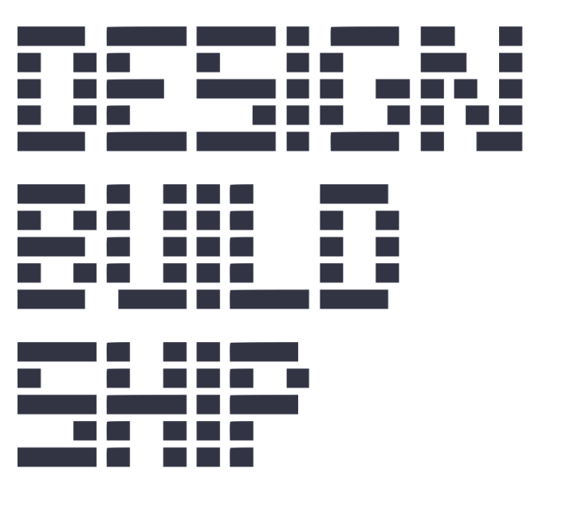

# gh-wallpaper

Your GitHub contribution heatmap as your macOS desktop wallpaper. Refreshes
itself in the background so your desktop always reflects what you've shipped
in the last year.




> Screenshots above are placeholders pulled from early renders. Real release
> shots will land before v0.1 is tagged.

---

## Install

```sh
brew install diegorico/tap/gh-wallpaper
```

> The Homebrew tap is not public yet. Until v0.1 is tagged, install from
> source — see [From source](#from-source) below. The tap path is the
> recommended install once it ships because Homebrew downloads bypass
> Gatekeeper's quarantine flag, so the unsigned binary launches without
> "this app is damaged" warnings.

### From source

```sh
git clone https://github.com/diegorico/gh-wallpaper
cd gh-wallpaper
./install.sh
```

`install.sh` checks for the Swift toolchain and `resvg`, builds with
`swift build -c release`, and copies the binary into your Homebrew prefix.

### Local tap (preview)

If you want to test the formula before the tap is public:

```sh
brew install --HEAD ./Formula/gh-wallpaper.rb
```

---

## 30-second walkthrough

```sh
brew install diegorico/tap/gh-wallpaper   # or ./install.sh from a clone
gh-wallpaper <your-github-username>
```

That's it. The first run scrapes your public profile, renders a poster,
and sets it as your wallpaper.

> **v0.1 reality check.** The setup wizard, the `start`/`pause`/`theme`/
> `displays`/`uninstall` subcommands, and the launchd daemon described
> below land in Wave 3. Today the binary is a single-shot renderer:
> `gh-wallpaper <username>` does one fetch + render + set. Re-run it
> whenever you want a refresh.

---

## What it does

Scrapes your public GitHub profile (no token, no auth, no API key), renders
your last ~53 weeks of contributions as oversized rounded cells beneath a
hand-designed `DESIGN. BUILD. SHIP.` headline, and sets the result as your
desktop wallpaper. Once the daemon ships, it'll keep itself in sync — poll
every couple of minutes on AC, longer on battery, instantly on wake. Until
then, re-run the command when you want a refresh.

---

## Configuration

Wave 3 wires up `gh-wallpaper` (no args) to launch a setup wizard that
prompts for username, theme, displays, and captures your previous
wallpaper for restoration on uninstall. Until then, the only configuration
is the positional username argument.

---

## Themes

Four themes ship with v0.1, plus an `auto` mode that follows the macOS
appearance setting:

- `github-light` — the classic green-on-white scale.
- `github-dark` — green-on-graphite, GitHub's dark mode palette.
- `paper` — single-ink deep navy on textured off-white.
- `midnight` — deep blue-purple gradient with a custom green ramp.
- `auto` — switches between `github-light` and `github-dark` based on
  `defaults read -g AppleInterfaceStyle`.

M1 hardcodes `github-dark`. Theme switching arrives with the wizard and
the `gh-wallpaper theme <name>` subcommand in Wave 3.

---

## Privacy

- No GitHub Personal Access Token. No OAuth. No login.
- Reads only your **public** contribution graph at
  `https://github.com/users/<you>/contributions` — the same endpoint that
  renders your profile to anyone visiting the page.
- No telemetry, no analytics, no phone-home. The binary talks to
  github.com and to your own filesystem. That's it.
- All state lives under `~/Library/Application Support/gh-wallpaper/` and
  `~/Library/Logs/gh-wallpaper/` on your Mac.
- No Keychain entries.

If you want private contributions to show up, toggle GitHub's
"Include private contributions on my profile" setting. The endpoint we
scrape honors it automatically.

---

## Uninstall

In v0.1:

```sh
gh-wallpaper uninstall
```

Removes the launchd agent, deletes config and per-display PNGs, and
restores your previous wallpaper (or, for Dynamic Desktops, opens the
Wallpaper settings pane so you can re-pick).

The `uninstall` subcommand lands in Wave 3 alongside the rest of the
CLI surface. Until then, manually delete:

```
~/Library/Application Support/gh-wallpaper/
~/Library/Logs/gh-wallpaper/
~/Library/LaunchAgents/dev.diegorico.gh-wallpaper.plist
```

…and `brew uninstall gh-wallpaper` (or remove the binary you copied from
`./install.sh`).

---

## Troubleshooting

```sh
gh-wallpaper diagnose
```

Prints install state, last refresh time, last error (if any), and whether
the HTML parser is happy with GitHub's current markup. If something looks
broken, this is the first thing to run before filing an issue. (Available
in Wave 3.)

Logs live at `~/Library/Logs/gh-wallpaper/agent.log`.

---

## Requirements

- macOS 14 (Sonoma) or newer
- [`resvg`](https://github.com/RazrFalcon/resvg) on your `PATH` (Homebrew
  installs this for you; `install.sh` will offer to as well)
- Swift 5.9 / Xcode 15+ if you're building from source

---

## Contributing

The full design and architecture lives in [`SPEC.md`](SPEC.md). Read it
before opening a PR — the spec covers what's in scope for v0.1, what's
deferred, and the "why" behind several non-obvious decisions
(no PAT, polling cadence, unsigned binary, etc.).

For release testing, see [`docs/RELEASE_TESTING.md`](docs/RELEASE_TESTING.md).

---

## License

MIT. See [LICENSE](LICENSE) once it lands; the repo header declares MIT
and that's the binding statement until then.
