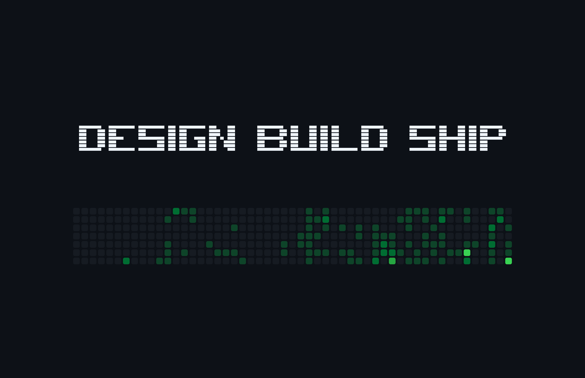

# gh-wallpaper

Your GitHub contribution heatmap as your macOS desktop wallpaper. Refreshes itself in the background so your desktop always reflects what you've shipped this year.



> Replace `image.png` with a real screenshot before tagging v0.1.

---

## Install

```sh
git clone https://github.com/Numbatt/gh-wallpaper
cd gh-wallpaper
./install.sh
```

`install.sh` checks for the Swift toolchain and `resvg`, builds the release binary, and copies it into your Homebrew prefix (or `/usr/local/bin`).

A public Homebrew tap (`brew install Numbatt/tap/gh-wallpaper`) will land with v0.1.

Then run the wizard:

```sh
gh-wallpaper
```

It'll ask for your GitHub username, theme, and which displays to use; preview the result; set the wallpaper; and register a background daemon. From that point on, your wallpaper updates itself.

---

## Themes

Four themes ship plus an `auto` mode that follows your macOS appearance:

- `github-dark` — green-on-graphite (default).
- `github-light` — classic green-on-white.
- `paper` — single-ink deep navy on textured off-white.
- `midnight` — deep blue-purple gradient with a custom green ramp.
- `auto` — switches between `github-light` and `github-dark` based on system appearance.

Switch any time:

```sh
gh-wallpaper theme paper
```

The wallpaper re-renders immediately and the new theme persists.

---

## How the background daemon works

`gh-wallpaper` installs a per-user launchd agent (`~/Library/LaunchAgents/dev.Numbatt.gh-wallpaper.plist`) that runs `gh-wallpaper --daemon` and stays alive in the background.

**Adaptive polling:**
- Every ~2 minutes on AC.
- Every ~5 minutes on battery.
- Paused entirely when offline; resumes on reconnect.

**Instant triggers** (debounced to 30s):
- Wake from sleep.
- Network reachability change.
- Display configuration change (monitor plugged/unplugged).
- Login.

Each tick fetches your contribution data, hashes it together with theme + display geometry + system appearance, and only re-renders when something actually changed. A no-op tick costs nothing on your side.

Control the daemon:

```sh
gh-wallpaper pause       # stop the daemon, keep config
gh-wallpaper start       # resume
gh-wallpaper refresh     # force an immediate refresh
gh-wallpaper diagnose    # install state, last refresh, errors
gh-wallpaper uninstall   # full clean: stops daemon, restores prior wallpaper, deletes config
```

Logs live at `~/Library/Logs/gh-wallpaper/agent.log` (rotating, 1 MB max).

---

## How it gets your contribution data

`gh-wallpaper` reads the **public** contribution graph from `https://github.com/users/<you>/contributions` — the exact endpoint that renders your profile to anyone visiting `github.com/<you>`.

- No GitHub Personal Access Token.
- No OAuth, no login, no API key.
- No telemetry, no analytics. The binary talks to `github.com` and your local filesystem. That's it.

If you want private contributions on the wallpaper, toggle GitHub's "Include private contributions on my profile" setting. The endpoint we read honors it automatically.

---

## Requirements

- macOS 14 (Sonoma) or newer
- [`resvg`](https://github.com/RazrFalcon/resvg) on your `PATH` (`brew install resvg`)
- Swift 5.9+ if building from source

---

## Design notes

Architecture, scope, and tradeoffs live in [`SPEC.md`](SPEC.md). License: MIT.
